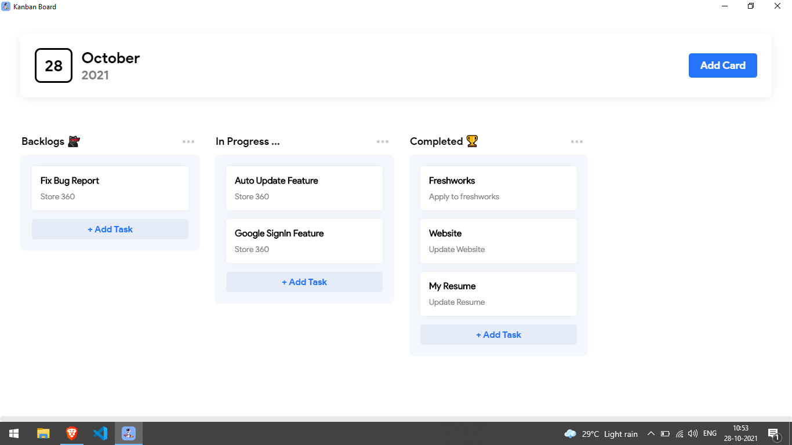

<p align="center">

</p>

<p align="center">Simple <b>Kanban</b> App that flipping works.</p>

<p align="center">
    
</p>

<p align="center">

</p>

<p align="center">
<table>
<tbody>
<td align="center">
<br>
Status: <b>Public Beta 🎉</b><br>
<sub> Made possible by Vue & Electron.</sub><br>
<p></p>
  <a href="https://github.com/Rubanthilak/kanban-board/releases/download/v1.0/Kanban.Board.Setup.1.0.0.exe">
    
    </a>
<br>
</td>
</tbody>
</table>

</p>

## Description

<div>
  <p>
    A Kanban App created inorder to keep tack of daily tasks. I love to learn by building real-time products that can be shipped to the user. So, here is the simple kanban board that runs locally in your system.
  </p>
  <p>
    If you are developer and love to experiment with this application, please do follow the below steps to setup the project in you machine.
  </p>
</div>

## Project setup

### Clone the repository using git clone command and then
```
npm install
```

### Compiles and hot-reloads for development

```
npm run serve
```

### Compiles and minifies for production

```
npm run build
```
## License

MIT License © 2021 [Ruban Thilak](https://github.com/rubanthilak)
